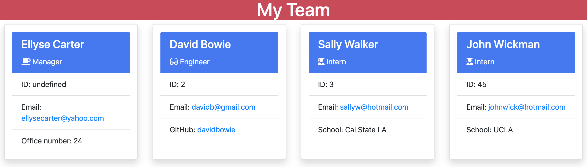

# Team Builder

## A way to keep track of your team!

## Table of Contents 

* [Description](#description)
* [Technologies used](#technologies-used)
* [Installation](#installation)
* [Usage](#usage)
* [Test](#tests)
* [Known bugs](#known-bugs)
* [Contact](#contact)

## Description 

Team Builder uses your terminal to dynamically keep track of your team members. Just answer the prompts with the appropriate details and we'll take care of the rest.

## Technologies Used
* HTML
* CSS
* JavaScript
* Node Package Manager
* NPM packages used: fs, inquirer, jest

## Installation 

Go to https://github.com/ellysecarter/team-builder and clone the SSH key. Next, go to the terminal on your computer and type in "git clone" and paste the key. After that, open the application in your VS code or another code application that you use. 

1) Install npm: https://www.npmjs.com/. 
2) Install Node JS via nmp: https://nodejs.org/en/download/package-manager/. 
3) Install the following npm packages: fs, inquirer, jest

## Usage 

In your terminal in VS code type in the following command: "node index.js" and follow prompt. Answer all the questions regarding your Team Manager, Engineer, and Intern. Once all information has been entered, head over to "index.html" in root folder and open it in your browser.

Demo video: https://watch.screencastify.com/v/eBD64vDAiLicJNTugYo8 

## Tests 

This project includes 4 test: Employee, Engineer, Intern and Manager
Once all required packages are installed, tests can be run using the following command: npm test

## Known Bugs
* ID for Manager shows as undefined. 

## Contact 

If you have any questions or would like to contribute to this project please reach out to me at ellysecarter@yahoo.com or [@ellysecarter](https://github.com/ellysecarter)

